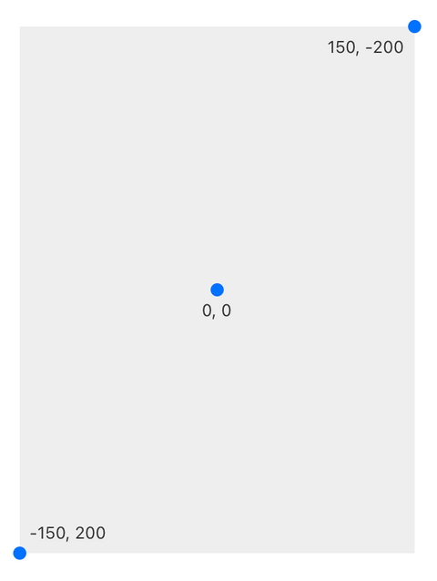
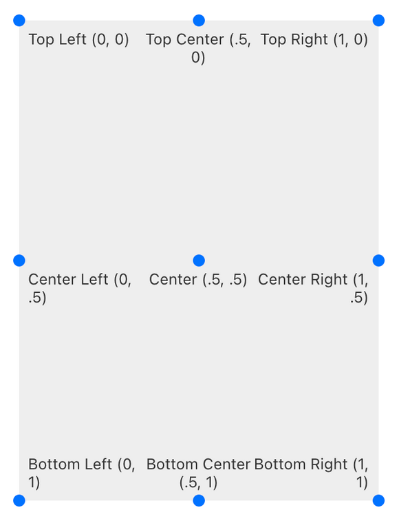

# Coordinates 坐标

Origami Studio use pt/dp coordinates instead of pixels. Specify position or size in pt/dp, and Origami will handle rendering layers at the appropriate density. For instance an iPhone 7 is 375x667 in points, but 750x1334 in pixels.

Origami Studio使用pt / dp单位为坐标，不是像素。 用pt / dp指定位置和大小 (板栗：设计图的1倍值，Sketch里的内置的设备的尺寸) ，Origami将以合适的密度显示图层。 例如，iPhone 7的点数为375x667 (例如：设计的1倍图) ，但像素为750x1334 (例如：设计的2倍图) 。

(例如：图层属性窗口中有两种坐标，一种是锚点Anchor坐标，用于对象的定位和对齐方式；另一种的图层的中心点Pivot坐标，像Ps中旋转时会有一个中心点，旋转时以那个点为圆心)

By default, the origin (x: 0, y: 0) is in the center of the device screen. On the X axis, coordinates increase as you move right, and decrease as you move left. On the Y axis, coordinates increase as you move down, and decrease as you move up.

默认情况下，坐标原点（x：0，y：0）在屏幕的中心。 X轴坐标，原点向右为正数，向左为负数。Y轴坐标，原点向下为正数，向上为负数。

For illustration, below is a Layer Group of height 400 pixels and width 300 pixels:

例如，下面是一个图层在屏幕中的坐标，图层高400宽300：

# Anchor Point 坐标锚点

Anchor points change the origin of the coordinate system for that patch. Anchor points can be defined in the Patch Editor with a Point patch, where X and Y are any decimal 0-1.

更改锚点会改变模块的坐标原点位置。 锚点可以通过### [Point]### 模块控制，X和Y的值可以是0～1之间的任何数。

Here’s an example of a Text Layer positioned from the “Top Left” Anchor Point:

下面是一个锚点在左上角的示意图：

From the bottom right:

锚点在右下角的文字图层：

If you want to inset it by 40 pixels, give it an X Position of -40 and a Y Position of -40.

如果你想把图层向左上方移动40像素，X和Y的值都要输入-40。

# Pivot 图层中心点

The pivot port changes the point about which a layer scales and rotates, and can be controlled separately from anchor points. Pivots can be defined in the Patch Editor with a Point patch, where X and Y are any decimal 0-1.

Pivot端口是图层缩放和旋转的中心点，这个中心点可以和锚点分开控制。中心点可以通过[Point](./../Utility/Point.md)模块控制，X和Y的值可以是0～1之间的任何数。

Center (.5, .5)

Top Left (0, 0)

Center Right (1, .5)
