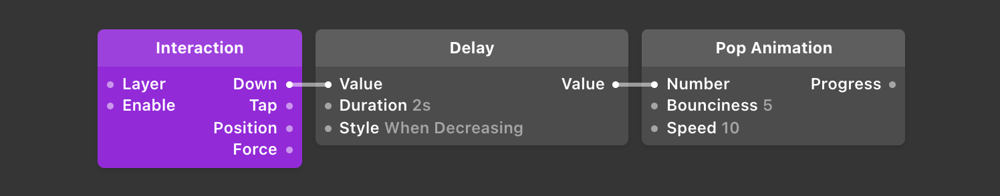

# States & Pulses 状态 & 脉冲

[States](./../Patch%20Editor/States.md)help remember information in your prototype. Pulses are used to tell patches to perform an action. Understanding how these work together will help you be more effective at building Origami prototypes.

状态帮助记住原型中信息。脉冲用来告诉模块反馈哪个动作。了解这些工作方式有助于更有效地构建原型。

例如：跟电路图其实差不多。【打开开关 → 电流通过 → 点亮灯泡】：打开 = 交互和操作模块；开关 = 交互对象模块；电流通过 = 发送脉冲；点亮灯泡 = 切换为定义的状态。

------

# States 状态

A state is a value that persists over time. The simplest version of state is in the Switch patch. Switches are either on or off, and they remain that way until you tell them otherwise.

状态是一个值持续的时间。

举个例子，最简单的能实现状态切换的模块是 ### Switch 开关模块。在没有 ### 打开或 ### 关闭前，状态是会保持不变的。

If we look at a state as it changes over time, it might look something like this:

假设开关本来是一个关闭，我们在 Frame 5 那里点了下开关，那状态图形化之后可能看起来是下面图中那样：

A switch is off until you turn it on. You can see the state goes from off to on immediately in a single frame. A frame is usually 1/60th of a second.

可以看到状态 Frame 1～4 是关闭的，Frame 5 之后开启了。一帧通常是1/60秒。

# Pulses 脉冲

While state persists over time, pulses are On ✓ only for a single frame. The value of the cable sending the pulse is otherwise off.

状态是一个持续时间，脉冲就不是，脉冲只持续一帧，把信息发送到了就撤了。 否则，这条线路就被占用了不能在发送其他的脉冲了。

A pulse over time looks like this:

状态的可视化图形大概就下面这样的：

You can see that pulses are only On ✓ for a single frame.

They’re used to tell patches to ### perform an action### , like telling a Switch to turn on or turn off. They’re also useful for passing along user interactions like tapping on the screen or pressing a key on the keyboard.

可以在图上看到脉冲只在 Frame 5 上显示了一下。用于告诉模块 ### 赶紧的切换状态，打开或关闭开关。

脉冲还可用于传递用户交互，例如在屏幕上点击或按键盘上的键。

# Examples of State & Pulses 状态&脉冲示例

- The [Switch](./../Utility/Switch.md) patch outputs the state of the **switch** (on / off) and accepts  **pulses** to flip the switch, turn it on, or turn it off.
- Switch模块接收一个交互模块发出的 **脉冲** ，根据指令输出开关的 **状态** 将其打开或关闭。
- The [Interaction](./../Interaction/Interaction.md) patch has Down and Tap outputs. Down represents the  **state** of whether the finger is currently down on the screen. The Tap port outputs a  **pulse** when the finger is released from the screen.
- Interaction模块有 Down 和 Tap 输出口。**Down** 表示手指在屏幕上按下时的 **状态** ，按下时输出脉冲。Tap 表示手指在屏幕上按下 - 松开时的 **状态** ，松开输出脉冲。
- The [Counter](./../Utility/Counter.md) patch outputs the  **state** of the counter (the number value) and accepts  **pulses** to increase it or decrease it.
- Counter模块输出计数器的 **状态** (数值)并接受来自其他模块的 **脉冲** 增加或减少数值。

# Creating Pulses from State 给状态创建脉冲

There are a couple ways to create a pulse from state. The more explicit way is to use the [Pulse](./../Utility/Pulse.md) patch. The Pulse patch accepts a state called On/Off and will output a pulse on the Turned On port when the state turns on and the Turned Off port when the state turns off. This is an example that flips a switch the moment the user touches the screen.

有几种方法从状态创建脉冲。 更明确的方法是使用[Pulse](./../Utility/Pulse.md)模块。 [Pulse](./../Utility/Pulse.md)模块接受一个称为On / Off的状态，并在状态打开时在Turned On端口输出脉冲，当状态关闭时，将输出Turned Off端口的脉冲。 这是在用户触摸屏幕的瞬间翻转开关的示例。

Another way is to infer a state change is to connect a state directly to a port accepting a pulse. What’ll happen is the port that accepts a pulse will look to when the state changes from off to on, and at that moment infer a pulse. So if you wanted a switch to flip when the user’s finger touches down on the screen, you can connect the Down port directly to the Switch’s Flip port, without needing to use a Pulse patch.

# Temporary State with the Delay patch 延迟模块和临时状态

Sometimes you need a state to turn on for a few moments and then turn off. For example, say you were making a confirmation window appear for a couple seconds after the user pressed a button. You could do this using a Switch, but then you’d need to build logic that turns the switch off after some time. A simpler way to do this is to use the [Delay](./../Utility/Delay.md) D patch.

有时你需要一个状态打开一会儿，然后自动关闭。 这里假设一个交互，用户按下按钮后出现确认窗口几秒钟，然后自动关闭。 可以使用 Switch 模块来做到这一点，但是你需要建立“在一段时间后关闭开关”的逻辑，一个更简单的方法是使用  [Delay](./../Utility/Delay.md)  模块替换 Switch。

The Delay patch can take state that’s changing and delay the change by an amount of time you specify. You can also tell it whether to only delay increasing (off to on) or decreasing (on to off) changes. If you give a Delay patch a pulse as input, you can delay the change from on to off, extending the pulse for any amount of time you’d like.

Delay 模块可以采取正在更改的状态，并将更改延迟时间设置为指定的值。还可以定义类型是有操作就激活，还是只在关闭到打开或打开到关闭时更改。

