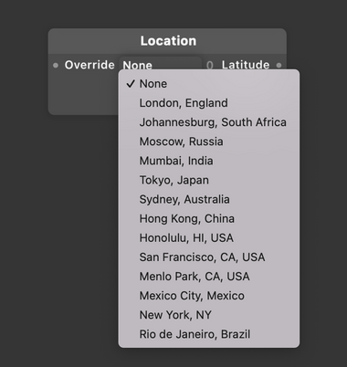

# Location 位置

Gets the current location of the device (using its GPS) and returns coordinates in the form of latitude and longitude. Connect to a [Map Layer](./../Layer/Map.md) to visualize the location.

获取设备的当前位置（使用其 GPS）并以纬度和经度的形式返回坐标。连接到 [Map Layer](./../Layer/Map.md) 以可视化位置。

### Override 覆盖

Override the current location with one from a list of places from around the world.

使用来自世界各地的地点列表中的一个覆盖当前位置。

### Latitude 纬度

The latitude of the current location.

当前位置的纬度。

### Longitude 经度

The longitude of the current location.

当前位置的经度。

### Name 名称

The name of the current location.

当前位置的名称

------

### Related Patches 相关模块

[Map 地图](./../Layer/Map.md)
