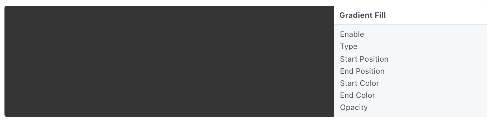

# Gradient Fill 渐变填充

Fill the screen with a linear gradient of two colors. The gradient’s start and end positions can be controlled to create vertical, horizontal or diagonal gradients. Clip color fills with groups set to a particular size.

用两种颜色的线性渐变填充屏幕。可以通过控制开始和结束位置控制渐变的方向。添加到组内时，组的大小可以控制图层的显示大小。

### Enable 启用

A boolean that is true when the layer is displayed.

勾选启用图层。

### Type 类型

The type of gradient: linear or radial.

线性或径向。

### Start Position 开始位置

The start position of the gradient.

渐变色第一个颜色的坐标。

### End Position 结束位置

The end position of the gradient.

渐变色第二个颜色的坐标。

### Start Color 开始颜色

The color at the start position of the gradient.

渐变色第一个颜色的色值。

### End Color 结束颜色

The color at the end position of the gradient.

渐变色第二个颜色的色值。

### Opacity 不透明度

The opacity of the layer.

图层的不透明度。

------

### Related Layers 相关图层

[Color Fill 颜色填充](./Color%20Fill.md)
