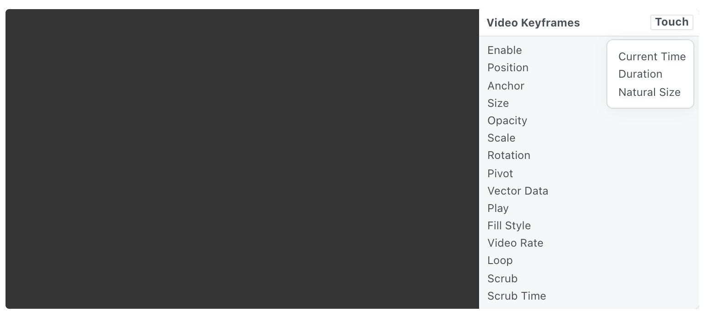

# Video Keyframes 视频关键帧

A layer that can play output of the Keyframes Exporter as a video. [Keyframes](https://facebookincubator.github.io/Keyframes/) is a library for converting Adobe After Effects shape based animations to a data format that allows rendering on iOS and Android devices.

一个图层，可以将 Keyframes Exporter的输出作为视频播放的。 Keyframes 是一个库，用于将Adobe After Effects基于形状的动画转换为数据格式，以便在iOS和Android设备上进行渲染。

### Enable 启用

A boolean that is true when the layer is displayed.

一个布尔值，表示显示图层时为真。

### Position 位置

The position to display the layer. Use [Point 3D](./../Utility/Point%203D.md) to set Z position.

图层的显示位置。使用 Point 3D 设置 Z 位置。

### Anchor 锚点

The anchor point to position the layer relative to. See [Coordinates 坐标](./../Concepts/Coordinates.md) for more information.

相对于图层定位的锚点。详细信息阅读[Coordinates 坐标](./../Concepts/Coordinates.md)。

### Size 大小

The size of the layer.

图层的大小。

### Opacity 不透明度

The opacity of the layer.

图层的不透明度。

### Scale 比例

The scale of the layer.

图层显示的比例。

### Rotation 旋转

图层的旋转。使用 Point 3D 设置 X 或 Y 旋转角度。

### Pivot 中心点

图层缩放、旋转、移动时的中心点或初始点。详细信息阅读[Coordinates 坐标](./../Concepts/Coordinates.md)。

### Vector Data 矢量数据

A JSON object containing the output from Keyframes Exporter for Adobe After Effects.

一个JSON对象，包含来自Adobe After Effects的 Keyframes Exporter 的输出。

### Play 播放

A boolean that is true when the video is playing.

一个布尔值，在视频播放时为真。

### Fill Style 填充样式

The image sizing behavior: fit, fill, stretch, or tile.

图像大小的调整样式：适合、填充、拉伸或平铺。

### Video Rate 视频速率

A number that represents the speed multiplier to play the video. 0 pauses the video. 2 plays it at twice the speed.

一个数字，表示表示播放视频的速度速率。0暂停视频。2以两倍的速度播放。

### Loop 循环

A boolean that is true when the video will loop to the beginning at the end.

一个布尔值，当视频从开始循环到结尾时为真。

### Scrub

A boolean that is true when the video will jump to the time specified in Scrub Time.

一个布尔值，当视频将跳转到 Scrub Time 中指定的时间时为真。

### Scrub Time

The time to jump the video to when Scrub is on.

将视频跳转到 Scrub 开启时的时间。

### Current Time 当前时间

The elapsed time of the video, in seconds.

视频经过的时间，以秒为单位。

### Duration 持续时间

The length of the video, in seconds.

视频的长度，单位是秒。

### Natural Size 原始大小

The original size of the Keyframes output.

关键帧输出的原始大小。

------

### Related Patches 相关模块

[Video Info 视频信息](./../Utility/Video%20Info.md)

[Video File 视频文件](./Video%20File.md)
