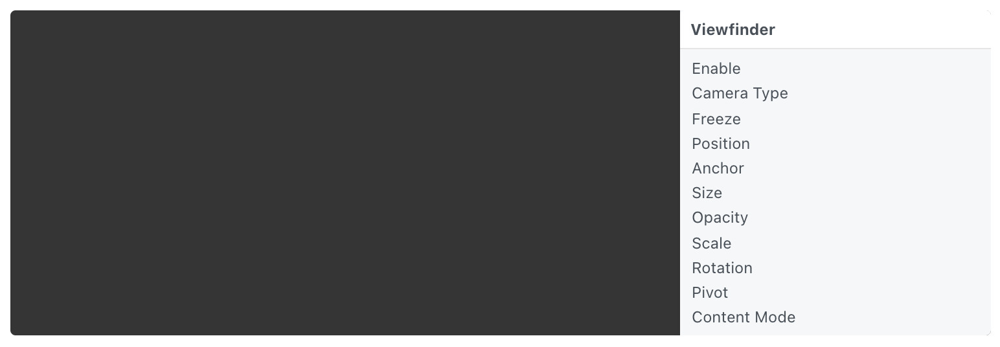

# Viewfinder 取景器

Say cheese! A live stream of the current computer, phone, or tablet’s camera. ‘Freeze’ the viewfinder to prototype taking a photo.

调用设备的相机，实时图像。 “Freeze”取景器到原型拍照。

### Enable 启用

A boolean that is true when the layer is displayed.

一个布尔值，表示启用图层。

### Camera Type 相机类型

The camera to use: front-facing or back-facing.

要使用的相机：前置或后置。

### Freeze 冻结

A boolean that is true when the camera is frozen on a shot. Useful when prototyping taking a photo.

勾选冻结时停时实时图像。原型需要拍摄照片时很有用。

### Position 位置

The position to display the layer. Use [Point 3D](./../Utility/Point%203D.md) to set Z position.

位置。点击属性名称 ### Position可以显示3个轴向并设置值。

### Anchor 锚点

The anchor point to position the layer relative to. See [Coordinates 坐标](./../Concepts/Coordinates.md) for more information.

组位于屏幕中的锚点，详细信息阅读[Coordinates 坐标](./../Concepts/Coordinates.md)。

### Size 尺寸

The size of the layer.

图层大小。

### Opacity 不透明度

The opacity of the layer.

图层的不透明度。

### Scale 比例

The scale of the layer.

图层的比例。

### Rotation 角度

The rotation of the layer. Use [Point 3D](./../Utility/Point%203D.md) to set X or Y rotations.

图层的角度。点击属性名称 ### Rotation可以显示3个角度并设置值。

### Pivot 轴心点

The pivot to rotate and scale the layer about. See [Coordinates 坐标](./../Concepts/Coordinates.md) for more information.

图层缩放、旋转、移动时的中心点或初始点。详细信息阅读[Coordinates 坐标](./../Concepts/Coordinates.md)。

### Content Mode 内容模式

The image sizing behavior: fit, fill, stretch.

图像尺寸：贴合，填充，拉伸。

------

### Related Patches 相关模块

[Camera 摄像头](./../Device/Camera.md)
