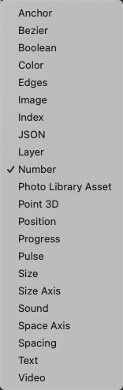

# Loop Shuffle 环随机排序

Randomly reorder values in a loop.

在循环中随机重新排序值。

Right-click to change the type of the loop.

右键单击以更改循环的类型。

### Loop 循环

A loop to randomly reorder values in.

一个需要随机重新排序值的循环。

### Shuffle 打乱顺序

A pulse that randomly reorders values in the loop.

一个脉冲，表示在循环中随机重新排序值。

### Loop 循环

The resulting loop with reordered values.

重新排序值后的结果循环。

### 支持类型

------

### Related Patches 相关模块

[Loop Dedupe 循环重复数据删除](./Loop%20Dedupe.md)

[Loop Reverse 循环反转](./Loop%20Reverse.md)
