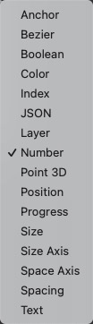

# Loop to Array 循环转换数组

Convert a loop to an array.

将循环转换为数组。

### Loop 循环

A loop of values.

包含值的循环

### Array 数组

A JSON array of values.

包含值的JSON数组。

### 支持类型

------

### Related Patches 相关模块

[Loop 循环](./Loop.md)

[Loop Builder 循环生成器](./Loop%20Builder.md)
