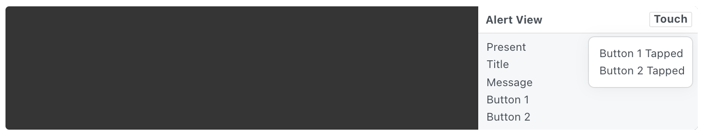

# Alert View 警示框

A Material alert view dialog with customizable actions.

具有可自定义操作的Material警示对话框。

Use the Touch button on the component to get the tap events on the buttons.

使用组件上的 Touch 按钮来获取按钮上的点击事件。

### Present 出现

A pulse to animate and display the layer.

用于动画和显示图层的脉冲。

### Title 标题 

The title text of the alert view.

警示框的标题文本。

### Message 信息

The message text of the alert view.

警示框的信息文本。

### Button 1 按钮 1

The text string for the first button.

第一个按钮的文本字符串。

### Button 2 按钮 2

The text string for the second button.

第二个按钮的文本字符串。

### Button 1 Tapped 按钮 1 点击

A pulse that represents when Button 1 is tapped.

一个脉冲，表示按钮 1 何时被点击。

### Button 2 Tapped 按钮 2 点击

A pulse that represents when Button 2 is tapped.

一个脉冲，表示按钮 2 何时被点击。

------

### Related Layers 相关图层

[Checkbox 复选框](./Checkbox.md)

[Fake Keyboard 模拟键盘](./Fake%20Keyboard.md)

[Page Control 分页控制器](./Page%20Control.md)

[Circular Progress 环形进度](./Circular%20Progress.md)

[Screen 屏幕](./Screen.md)

[Status Bar 状态栏](./Status%20bar.md)

[Switch 开关](./Switch.md)

[Text Field 文本输入框](./Text%20Field.md)
