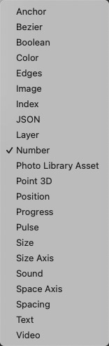

# Option Picker 选项选择器

This holds a list of options and then allows you to choose one of them. This can be used to switch between different colors for a layer, for example. The first input controls which value is chosen. Often used with Option Switch to control which option is picked. Formerly known as Multiplexer.

包含一个选项列表，然后允许您选择其中一个。 例如，这可用于在图层的不同颜色之间切换。 第一个输入控制选择哪个值。 通常与选项开关一起使用来控制选择哪个选项。 以前称为多路复用器。

If you are a programmer looking for an “if statement” or “case statement”, this patch gives similar functionality but in an Origami style.

如果您是寻找“if 语句”或“case 语句”的程序员，此模块提供了类似的功能，但采用了 Origami 风格。

Right-click to change the type (ex: number, text, color), or to add additional options.

右键单击以更改类型（例如：数字、文本、颜色）或添加其他选项。

### Option

An index (starting at 0) that represents the option to output.

一个索引值（从 0 开始），表示输出选项。Option Switch 模块的输出端口一般连接到这里。

### Input 输入

A value that represents option 0.

一个值，表示选项 0。

### Input 输入

A value that represents option 1.

一个值，表示选项 1.

### Output

The picked value.

输出选中的交互的值。

一般连接到要要切换的属性值，如果需要添加动画，则在 Option Picker 模块和属性值模块中间插入动画模块。

### 支持类型

------

### Related Patches 相关模块

[Option Switch 选项开关](./Option%20Switch.md)

[Option Sender 选项发送器](./Option%20Sender.md)

[Option Equals 选项相等](./Option%20Equals.md)
