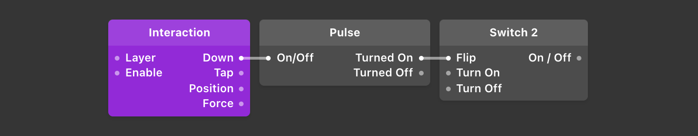

# States & Pulses 状态 & 脉冲

---

[States](./../PatchEditor/States.md)帮助记住原型中信息。脉冲用来告诉模块反馈哪个动作。了解这些工作方式有助于更有效地制作原型。

例如：我们常见的电路图。

**打开开关 → 电流通过 → 点亮灯泡：**

打开 = 交互和操作模块；

开关 = 交互对象模块；

电流通过 = 发送脉冲；

点亮灯泡 = 切换为定义的状态。

---

## States 状态

状态是一个值持续的时间。

举个例子，最简单的实现状态切换的模块是 Switch 开关模块。在没有打开或关闭前，状态是保持不变的。

假设开关本来是关闭状态，我们在 Frame 5 那里点了下开关，那状态可视化之后看起来会是下面图中那样：

可以看到状态 Frame 1 ～ 4 是关闭的，Frame 5 之后开启了。一帧通常是 1/60 秒。

## Pulses 脉冲

状态是一个持续时间，脉冲就不是，脉冲只持续一帧，把信息发送到了就没了。 否则，这条线路就会被占用，不能在发送其他的脉冲。

A pulse over time looks like this:

脉冲的可视化之后大概就是下面这样的：

可以在图上看到脉冲只在 Frame 5 上显示了一下。用于告诉模块赶紧的切换状态，打开或关闭开关。

脉冲还可用于传递用户交互，例如在屏幕上点击或按了键盘上的按键。

## Examples of State & Pulses 状态&脉冲示例

- [Switch](./../Utility/Switch.md) 模块接收一个交互模块发出的 **脉冲** ，根据指令输出开关的 **状态** 将其打开或关闭。
- [Interaction](./../Interaction/Interaction.md) 模块有 Down 和 Tap 输出口。**Down** 表示手指在屏幕上按下时的 **状态** ，按下时输出脉冲。Tap 表示手指在屏幕上按下 - 松开时的 **状态** ，松开输出脉冲。
- [Counter](./../Utility/Counter.md) 模块输出计数器的 **状态** (数值)并接受来自其他模块的 **脉冲** 增加或减少数值。

## Creating Pulses from State 给状态创建脉冲

有几种方法从状态创建脉冲。 比较准确的方法是使用[Pulse](./../Utility/Pulse.md)模块。

[Pulse](./../Utility/Pulse.md)模块接受一个称为 On / Off 的状态，并在状态打开时在 Turned On 端口输出脉冲，当状态关闭时，将输出 Turned Off 端口的脉冲。 这是在用户触摸屏幕的瞬间切换开关的示例。

另一种判断状态变化的方法是将状态直接连接到接收脉冲的端口。

接收脉冲的端口将观察状态何时由关变为开，并在那一刻推断出脉冲。因此，如果你想让开关在用户手指触碰屏幕时翻转，你可以直接将 down 端口连接到 switch 的 flip 端口，而不需要使用 Pulse 模块。

## Temporary State with the Delay patch 延迟模块和临时状态

有时你需要一个状态打开一会儿，然后自动关闭。

这里假设一个交互，用户按下按钮后出现确认窗口几秒钟，然后自动关闭。

可以使用 Switch 模块来做到这一点，但是你需要建立 “在一段时间后关闭开关” 的逻辑，一个更简单的方法是使用 [Delay](./../Utility/Delay.md) 模块替换 Switch。

Delay 模块可以采取正在更改的状态，并将更改延迟时间设置为指定的值。还可以定义类型是有操作就激活，还是只在关闭到打开或打开到关闭时更改。

