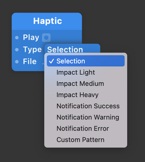

# Haptic 触觉

Access the haptic engine on an iPhone or iPad.

在iPhone或ipad上访问触觉引擎。

### Play 播放

A pulse that plays the selected haptic feedback.

一个脉冲，表示播放选定的触觉反馈。

### Type 类型

The type of haptic response to activate on the iPhone (Selection, Impact Light, Impact Medium, Impact Heavy, Notification Success, Notification Warning, Notification Error)

在iPhone上激活的触觉响应类型（选择，影响轻、影响中、影响重、通知成功，通知警告，通知错误）

### File 文件

------

### Related Patches 相关模块

[Vibrate 震动](./Vibrate.md)

[Trackpad Haptic 触控板触觉](./Trackpad%20Haptic.md)
