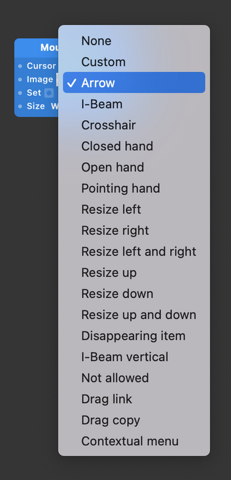

# Mouse Cursor 鼠标手势

Control the system mouse cursor.

控制系统鼠标的光标。

### Cursor 光标

Choose from a standard list of cursors, such as I-beam which is used for text insertion. To use an image, choose Custom in this port.

从默认的光标列表中进行选择，例如用于文本插入的 I-beam。

要使用图像，请在此端口中选择 Cusom 自定义。

### Image 图片

This can be used to change the cursor to any image. Make sure the Cursor port is set to “Custom” or this image will be ignored.

可以将光标更改为任何图像。确保 Cursor光标 端口设置为“Custom自定义”，否则此图像将被忽略。

### Set 设置

This is the signal to actually change the cursor. When this pulse is on then the cursor change takes effect.

这是实际改变光标的信号。当此脉冲开启时，光标更改生效。

### 支持的鼠标手势

------

### Related Patches 相关模块

[Mouse 鼠标](./../Interaction/Mouse.md)

