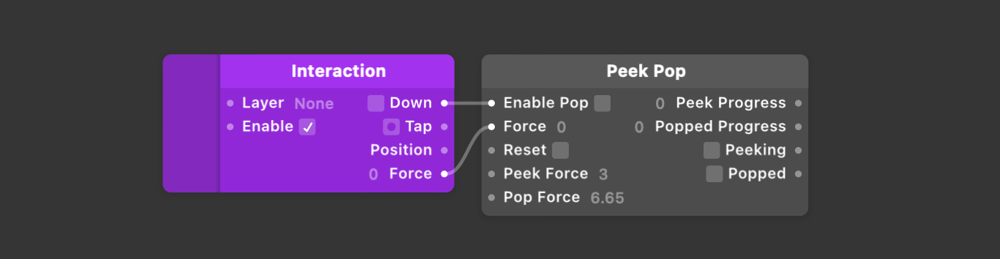

# Peek Pop 轻压重压

Allows you to build prototypes using Apple’s Peek/Pop 3D Touch feature from iOS 9. This patch takes in a touch force and exposes peek progress, pop progress and whether or not the current content should be peeking or popped.

允许你使用 iOS 9 的苹果 Peek/Pop 3D Touch 功能来构建原型。这个模块在触摸力度和轻压力度，重压力度以及是否允许当前的内容可以被轻压或重压。

    

        <h3>Peek Pop</h3>
        <ul className="inputs">
            <li>Enable Pop</li>
            <li>Force0</li>
            <li>Reset</li>
            <li>Peek Force3</li>
            <li>Pop Force6.65</li>
        </ul>
        <ul className="outputs">
            <li>Peek Progress0</li>
            <li>Popped Progress0</li>
            <li>Peeking</li>
            <li>Popped</li>
        </ul>
    

### Enable Pop 启用轻压

一个布尔值，当接收到交互模块启用时为真。

### Force 压力

一个数字，表示接收到的触摸的压力值。

### Reset 重置

一个布尔值，表示是否重置交互。

### Peek Force 轻压力度

一个数字，表示达到轻压所需的力度。

### Pop Force 重压力度

一个数字，表示达到重压所需的力度。

### Peek Progress 轻压进度

一个从 0 到 1 的数字动画，表示当前轻压的力度。

### Popped Progress 重压进度

一个从 0 到 1 的数字动画，表示当前重压的力度。

### Peeking 是否轻压

一个布尔值，表示当前是否被轻压。

### Popped 是否重压

一个布尔值，表示当前是否被重压。

---

### Related Patches 相关模块

[Interaction 交互](./Interaction.md)

---

### ### Sample 示例

如图：

当检测到按下时， Enable Pop 输入端口为真，Force 输入端口显示当前压力值的数字，当压力值从 0 到 3 时，Peek Progress 输出端口做从 0 到 1 的动画，并输出为 1，当前压力值从 3 到 6.65 时，Popped Progress 输出端口从 0 到 1 的动画，并输出为 1，当压力值达到 3 和 6.65 时，Peeking 和 Popped 端口输出为真。
