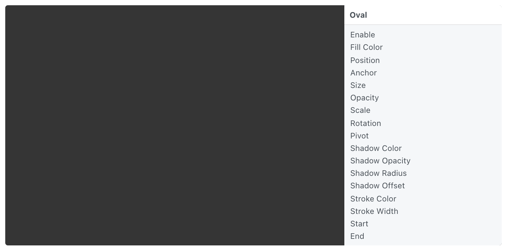

# Oval 椭圆形

An oval of specific size and fill color.

具有特定大小和填充颜色的椭圆形。

### Enable 启用

A boolean that is true when the layer is displayed.

勾选启用图层。

### Fill Color

The color of the layer.

图层的颜色。

### Position 位置

The position to display the layer. Use [Point 3D](./../Utility/Point%203D.md) to set Z position.

显示图层的位置。使用 Point 3D 设置 Z 位置。

### Anchor 锚点

The anchor point to position the layer relative to. See [Coordinates 坐标](./../Concepts/Coordinates.md) for more information.

相对于图层定位的锚点。详细信息阅读[Coordinates 坐标](./../Concepts/Coordinates.md)。

### Size 尺寸

The size of the layer.

图层的大小

### Opacity 不透明度

The opacity of the layer.

图层的不透明度。

### Scale 比例

The scale of the layer.

图层显示的比例。

### Rotation 角度

The rotation of the layer. Use [Point 3D](./../Utility/Point%203D.md) to set X or Y rotations.

图层的旋转。使用 Point 3D 设置 X 或 Y 旋转角度。

### Pivot 轴心点

The pivot to rotate and scale the layer about. See [Coordinates 坐标](./../Concepts/Coordinates.md) for more information.

图层缩放、旋转、移动时的中心点或初始点。详细信息阅读[Coordinates 坐标](./../Concepts/Coordinates.md)。

阴影：

### Shadow Color 阴影颜色

The color of the shadow.

阴影的颜色。

### Shadow Opacity 阴影不透明度

The opacity of the shadow. By default, the opacity is 0, which disables the shadow.

阴影的不透明度。 默认值为0，不显示阴影。

### Shadow Radius 阴影半径

The blur radius of the shadow.

阴影的模糊半径值。（值越大范围越大，颜色越淡）

### Shadow Offset 阴影偏移

The size of the shadow relative to the size of the layer.

阴影相对于图层的距离和角度。

### Stroke Color 描边颜色

The color of the stroke.

描边的颜色。

### Stroke Width 描边宽度

The width of the stroke. By default, the width is 0, which disables the stroke.

描边的宽度。默认情况下宽度为0，不显示描边。

### Start 开始

A number from 0 to 1 that represents the start of the stroke.

描边开始的位置。

### End 结束

A number from 0 to 1 that represents the end of the stroke.

描边结束的位置。

------

### Related Layers 相关图层

[Rectangle 矩形](./Rectangle.md)
