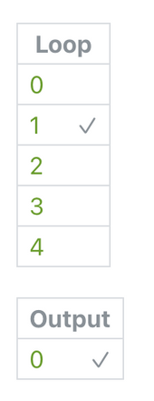

# Any 任意

Check if any of the booleans in a loop are true.

检查循环中的任何布尔值是否为真。

Often used with an [Interaction](./../Interaction/Interaction.md) patch on a looped layer to check when any of the layers are tapped.

通常与循环图层上的交互模块一起使用，以检查突出什么时候被点击。

### Loop 循环

A loop of booleans.

一个包含布尔值的循环

### Grouping 分组

For advanced use only. An index or a loop of indices. By default, the number is -1.

仅供高级使用。索引或索引循环。默认情况下，该数字为 -1。

### Output 输出

A boolean that is true if any of the loop of booleans are true. If a loop is passed into Grouping, then a loop of booleans.

如果布尔值循环中的任何一个为真，则该布尔值为真。

如果一个循环被传递到分组中，那么它就是一个布尔值循环。

------

### Related Patches 相关模块

[Interaction 交互](./../Interaction/Interaction.md)

[Loop 循环](./Loop.md)

[Loop Builder 循环生成器](./Loop%20Builder.md)

