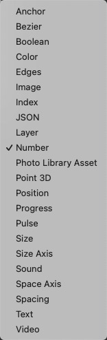

# Loop Dedupe 循环重复数据删除

Remove duplicate values in a loop.

删除循环中的重复值。

Right-click to change the type of the loop.

右键单击以更改循环的类型。

### Loop 循环

A loop to remove duplicate values from.

需要删除重复数据的循环。

### Loop 循环

The resulting loop without duplicated values.

没有重复数据的循环。

### Index 索引

A loop of the indices for the output values. ex: [0, 1, 2]

输出数据的索引循环。例如：[0, 1, 2]

### 支持的类型

------

### Related Patches 相关模块

[Loop Remove 循环移除](./Loop%20Remove.md)

[Loop Remove Last 循环末尾移除](./Loop%20Remove%20Last.md)

[Loop Reverse 循环反转](./Loop%20Reverse.md)

[Loop Shuffle 循环随机排序](./Loop%20Shuffle.md)
