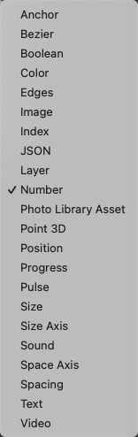

# Loop Insert at End 循环结尾插入

Insert a value at the end of a loop.

插入一个值在循环的结尾。

Right-click to change the type of the loop and inserted value.

右键单击以更改循环的类型和插入的值。

### Loop 循环

A loop of to insert a value to.

向其中插入值的循环。

### Value 值

A value to insert into the loop.

要插入循环的值。

### Insert at End 在结尾插入

A pulse that inserts the value at the end of the loop.

一个脉冲，表示将值插入循环结尾。

### Loop 循环

The resulting loop with the inserted value.

带有插入值的结果循环。

### Index 索引

A loop of indices.

索引循环。

### 支持类型

------

### Related Patches 相关模块

[Loop Insert 循环插入](./Loop%20Insert.md)

[Loop Remove 循环移除](./Loop%20Remove.md)

[Loop Remove Last 循环末尾移除](./Loop%20Remove%20Last.md)
