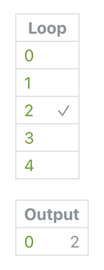

# Loop Option Switch 循环选项开关

Find the index of the last pulsed item in a loop of pulses.

查找脉冲循环中最后一个脉冲项的索引。

Often used with an [Interaction](./../Interaction/Interaction.md) patch on a looped layer to check which of the layers was tapped.

通常在循环的图层上添加一个交互模块，以检查哪个图层被点击了。

### Input 输入

A loop of pulses.

一个脉冲循环

### Option 选项

An index that represents the last pulsed item in a loop.

一个索引，表示循环中最后一个脉冲项的位置。

------

### Related Patches 相关模块

[Option Switch 选项开关](./../Utility/Option%20Switch.md)

[Interaction 交互](./../Interaction/Interaction.md)

[Loop 循环](./Loop.md)
