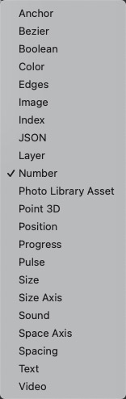

# Loop Remove Last 循环末尾移除

Remove the last value from a loop.

从循环中删除最后一个值。

Right-click to change the type of the loop.

右键单击以更改循环的类型。

### Loop 循环

A loop to remove the last value from.

需要删除最后一个值的循环。

### Remove Last 删除末尾

A pulse that removes the last value from the loop.

一个脉冲，表示从循环中删除最后一个值。

### Loop 循环

The resulting loop with the last value.

删除最后一个值后的结果循环。

### Index 索引

A loop of indices

索引循环

### 支持类型

------

### Related Patches 相关模块

[Loop Insert 循环插入](./Loop%20Insert.md)

[Loop Insert at End 循环结尾插入](./Loop%20Insert%20at%20End.md)

[Loop Remove 循环移除](./Loop%20Remove.md)
