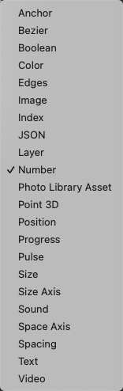

# Loop Remove 循环移除

Remove a value from a particular index of a loop.

从循环的特定索引中删除一个值。

Right-click to change the type of the loop.

右键单击以更改循环的类型。

### Loop 循环

A loop to remove a value from.

要从中删除一个值的循环。

### Index 索引

A loop index to remove the value from.

用于从其中删除值的循环索引。

### Remove 移除

A pulse that removes the value from the loop.

一个脉冲，表示从循环中移除值。

### Loop 循环

The resulting loop without the removed value.

删除值的后结果循环。

### Index 索引

A loop of indices

索引的循环

### 支持类型

------

### Related Patches 相关模块

[Loop Insert 循环插入](./Loop%20Insert.md)

[Loop Insert at End 循环结尾插入](./Loop%20Insert%20at%20End.md)

[Loop Remove 循环移除](./Loop%20Remove.md)
