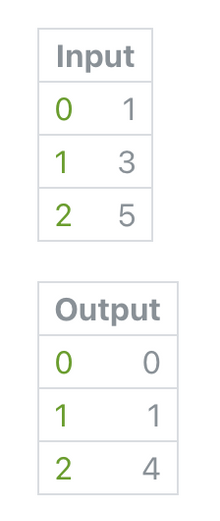

# Running Total 累积总计

Calculate the sums of a loop of numbers, where the sum at each index is the sum of the numbers preceding the current number.

计算数字循环的总和，其中每个索引处的总和是当前数字之前的数字的总和。

To calculate the total sum of all numbers, use the [Sum](./Loop%20Sum.md) patch.

要计算所有数字的总和，请使用 Sum 模块。

### Input 输入

A loop of numbers, indices, or booleans.

数字、索引或布尔值的循环。

### Output 输出

A loop of sums.

一个循环的总和。

### 支持类型

------

### Related Patches 相关模块

[Loop 循环](./Loop.md)

[Loop Builder 循环生成器](./Loop%20Builder.md)

[Loop Count 循环数量](./Loop%20Count.md)

[Loop Sum 循环总和](./Loop%20Sum.md)
