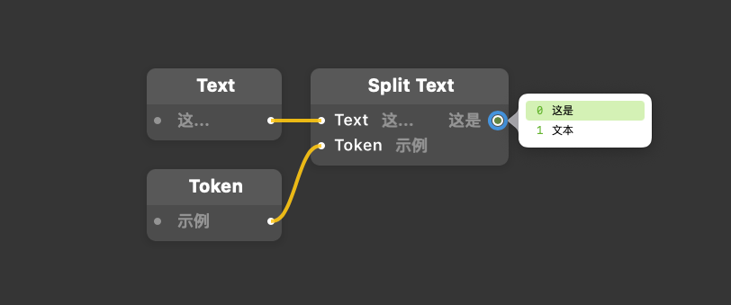

# Split Text 拆分文本

Splits the text into a loop using the token.

使用标记将文本拆分为循环。

### Text 文本

A text string to evaluate.

待处理的文本

### Token 标记

A text string to find and split the the text into parts around.

一个文本字符串，用于查找以这个标记文本位置将整个文本分割为几个部分。

### Output 输出

A loop of the parts of the text split by the token. The entire text will be returned if the token is not found.

将标记分割出来几个部分的文本组成循环。如果没有找到输入的标记文本，将返回整个文本。

------

### Sample  示例

如图：

输入的 ### Text 文本文本字符串为：这是示例文本。

输入的 ### Token 标记文本字符串为：示例。

### Output 输出将输出循环为：[这是] [文本]。

------

### Related Patches 相关模块

[Trim Text 修剪文本](./Trim%20Text.md)

[Text Replace 文本替换](./Text%20Replace.md)

------

### Related Layers 相关图层

[Text Layer 文本图层](./../Layer/Text%20Layer.md)
