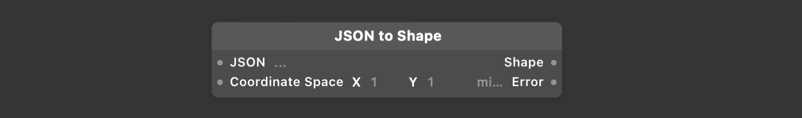

# JSON to Shape JSON 转换图形

Takes a JSON with the following structure and commands to create a shape object:

使用带有以下结构和命令的JSON来创建一个shape对象:

```
{   "path" : [     // Array of Commands to build the shape   ] }
```

The commands accepted in the array are the following:

数组中接受的命令如下:

moveTo: Move the current point to (x, y) and begin a new subpath.

moveTo: 将当前点移动到(x, y)并开始一个新的子路径。

```
{   "type" : "moveTo"   "point" : {     "x" : 0,     "y" : 0   } }
```

lineTo: Append a straight line segment from the current point to (x, y) in shape and move the current point to (x, y).

### lineTo### : 将当前点的直线段附加到(x, y)，并将当前点移动到(x, y)。

```
{   "type" : "lineTo"   "point" : {     "x" : 0,     "y" : 0   } }
```

curveTo: Append a cubic bézier curve from the current point to “curveTo(x,y)” with control points “curveFrom(x, y)” and “point(x, y)” in “shape” and move the current point to “(x, y)”.

curveTo : 附加一个三次方贝塞尔曲线从当前点到“curveTo(x,y)”与控制点“curveFrom(x, y)”和“点(x,y)”在“形状”，并移动当前点到“(x, y)”。

```
{   "type" : "curveTo",   "curveFrom" : {     "x" : 0,     "y" : 0   },   "point" : {     "x" : 0,     "y" : 0   },   "curveTo" : {     "x" : 0,     "y" : 0   } }
```




### JSON

A JSON Object that follows the path structure.

遵循路径结构的JSON对象。

### Coordinate Space 坐标空间

A width and height value that will act as a scale multiplier for every x,y component on the shape.

宽度和高度值，将作为形状上每个x、y组件的比例相乘。

### Shape 图形

A shape object.

一个图形对象

### Error 错误

A string with an explanation of an error, if there was an error with the path structure.

如果路径结构存在错误，则为带有错误解释的字符串。

------

### Related Layers 相关图层

[Shape 形状](./../Layer/Shape.md)
