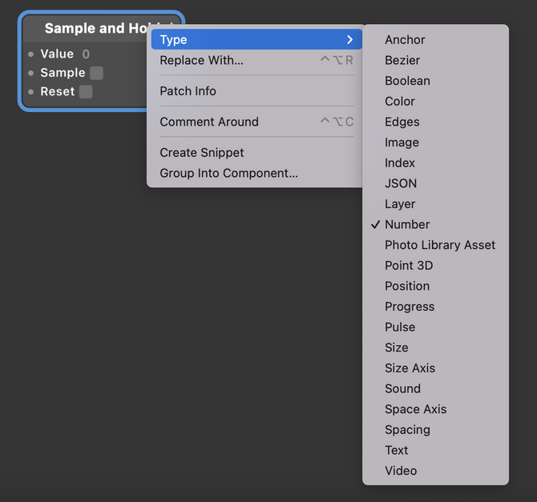

# Sample and Hold 采样保持

Store a value of any type. The patch will store the value until a new value is sampled or until the current value is reset.

存储任何类型的值。模块将存储采集的值，直到新值被采样或直到当前值被重置为止。

Right-click to change the type (ex: number, text, color).

右键更改接口数量和类型。

### Value 值

A value of any type. By default, the value is a number.

一个任意类型的值，通常是数字。

### Sample 采样

A boolean that is true when the patch is sampling a value. When false, the patch will not sample the value, even if it changes. The patch outputs the most recently sampled value.

一个布尔值，当模块对值采样时为true。

当值为false时，模块不会对该值进行采样，即使更改。

模块输出最近采样的值。

通俗解释就是Sample开关打开，Value的值就会输出到输出端口。

### Reset 重置

A pulse that clears the currently stored value.

一个脉冲，表示在输出端口清除当前存储的值，重置为 0 。

### Type 类型

### Output 输出

The currently stored value.

输出当前存储的值

------

### Related Patches 相关模块

[Pulse 脉冲](./Pulse.md)

[Interaction 交互](./../Interaction/Interaction.md)
