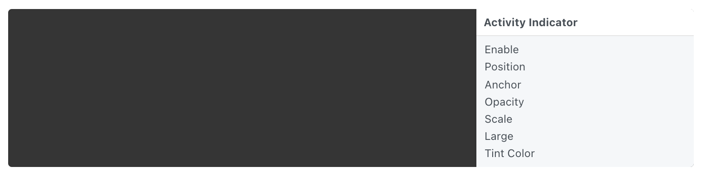

# Activity Indicator 状态指示器

An iOS activity indicator with customizable color and size.

可定制颜色和大小的IOS活动指示器。

### Enable 启用

A boolean that is true when the indicator is displayed.

一个布尔值，表示显示指示灯时为真。

### Position 位置

The position to display the indicator.

指示器的显示位置。

### Anchor 锚点

The anchor point to position the indicator relative to. See [Coordinates 坐标](./../Concepts/Coordinates.md) for more information.

定位指示器所相对的锚点。有关更多信息，请参阅坐标。

### Opacity 不透明度

The opacity of the indicator.

指示器的不透明度。

### Scale 比例

The scale of the indicator

指示器的比例。

### Large 大号

A boolean that is true when displaying a large version of the indicator.

一个布尔值，表示在显示大版本的指示灯时，布尔值为真。

### Tint Color 色调颜色

The color of the indicator.

指示器的颜色。

------

### Related Layers 相关图层

[Action Sheet 操作列表](./Action%20Sheet.md)

[Alert View 警示框](./Alert%20View.md)

[Fake Keyboard 模拟键盘](./Fake%20Keyboard.md)

[Navigation Bar 导航栏](./Navigation%20Bar.md)

[Notification 通知](./Notification.md)

[Page Control 分页控制器](./Page%20Control.md)

[Screen 屏幕](./Screen.md)

[Segmented Control 分段控制器](./Segmented%20Control.md)

[Slider 滑块](./Slider.md)

[Status Bar 状态栏](./Status%20bar.md)

[Switch 开关](./Switch.md)

[Tab Bar 标签栏](./Tab%20Bar.md)

[Text Field 文本输入框](./Text%20Field.md)

[Visual Effect 毛玻璃效果](./Visual%20Effect.md)
