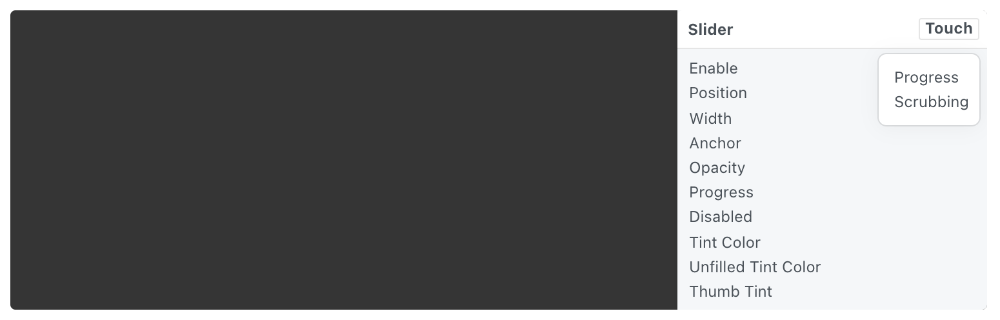

# Slider 滑块

An iOS slider with customizable size and colors.

一个可定制大小和颜色的iOS滑块。

Use the Touch button on the component to get information about the slider.

使用组件上的触摸按钮获取有关滑块的信息。

### Enable 启用

A boolean that is true when the slider is displayed.

一个布尔值，表示滑块显示时为真。

### Position 位置

The position to display the slider.

显示滑块的位置。

### Width 宽度

The width of the slider.

滑块的宽度。

### Anchor 锚点

The anchor point to position the slider relative to. See [Coordinates](./../Concepts/Coordinates.md) for more information.

相对于滑块的定位锚点。有关详细信息，请参阅坐标。

### Opacity 不透明度

The opacity of the slider.

滑块的不透明度。

### Progress 进度

A progress value from 0 to 1 that represents where to jump the slider to.

从 0 到 1 的进度值，表示将滑块跳转到的位置。

### Disabled 禁用

A boolean that is true when the slider is displayed but disabled. Fades the slider.

一个布尔值，当滑块显示但禁用时为真。淡化滑块。

### Tint Color 色调颜色

The color of the active portion of the slider to the left of the knob.

旋钮左侧滑块活动部分的颜色。

### Unfilled Tint Color 未填充的色调颜色

The color of the inactive portion of the slider to the right of the knob.

旋钮右侧滑块的非活动部分的颜色。

### Thumb Tint 拇指色调颜色

The color of the knob to adjust the slider.

用于调整滑块的旋钮颜色。

### Progress 进度

A progress value that represents the current position of the slider from 0 to 1.

一个进度值，表示滑块从 0 到 1 的当前位置。

### Scrubbing 拖动

A boolean that is true when the knob is being dragged.

一个布尔值，表示拖动旋钮时为真。

------

### Related Patches 相关模块

------

### Related Layers 相关图层

[Action Sheet 操作列表](./Action%20Sheet.md)

[Activity Indicator 状态指示器](./Activity%20Indicator.md)

[Alert View 警示框](./Alert%20View.md)

[Fake Keyboard 模拟键盘](./Fake%20Keyboard.md)

[Navigation Bar 导航栏](./Navigation%20Bar.md)

[Notification 通知](./Notification.md)

[Page Control 分页控制器](./Page%20Control.md)

[Screen 屏幕](./Screen.md)

[Segmented Control 分段控制器](./Segmented%20Control.md)

[Status Bar 状态栏](./Status%20bar.md)

[Switch 开关](./Switch.md)

[Tab Bar 标签栏](./Tab%20Bar.md)

[Text Field 文本输入框](./Text%20Field.md)

[Visual Effect 毛玻璃效果](./Visual%20Effect.md)
