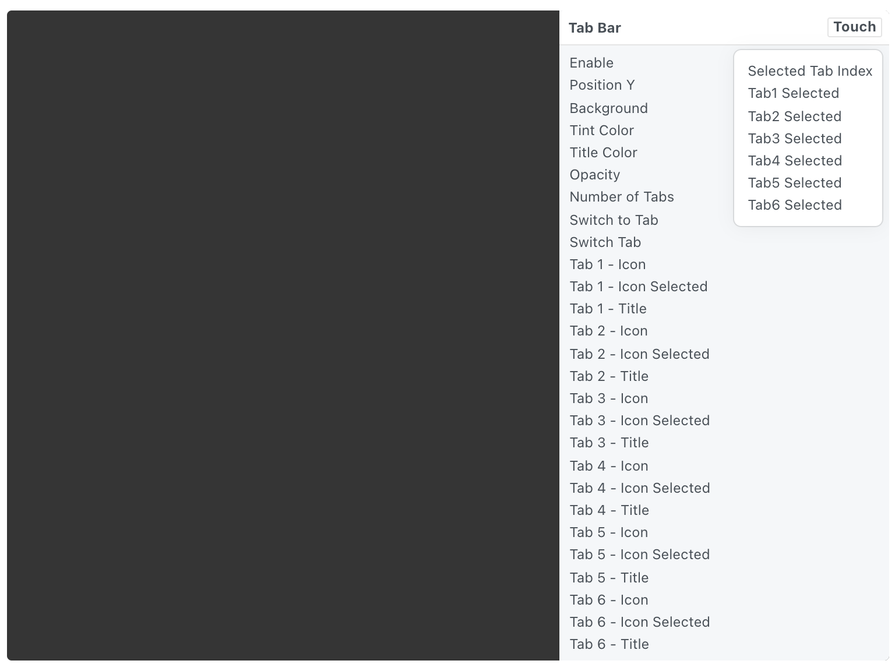

# Tab Bar 标签栏

An iOS tab bar with customizable tabs.

可自定义标签的iOS标签栏。

Use the Touch button on the component to get information about the selected tab.

使用组件上的触摸按钮获取有关所选选项卡的信息。

### Enable 启用

A boolean that is true when the tab bar is displayed.

一个布尔值，表示显示标签栏时为真。

### Position Y Y位置

The vertical position of the tab bar relative to the bottom of its parent group or screen.

标签栏相对于其父组或屏幕底部的垂直位置。

### Background 背景

The color of the tab bar.

标签栏的背景颜色。

### Tint Color 色调颜色

The color of the title of the selected tab.

所选中标签的标题颜色。

### Title Color 标题颜色

The color of the title of the unselected tabs.

未选中标签的标题颜色。

### Opacity 不透明度

The opacity of the tab bar.

标签栏的不透明度。

### Number of Tabs 标签数量

A number representing the number of items in the tab bar.

一个数字，表示选项卡栏中的项目数量。

### Switch to Tab 切换到标签

The index of the tab to switch to, starting at 0.

要切换到的选项卡的索引，从 0 开始。

### Switch Tab 切换标签

A pulse that changes the currently selected tab.

一个脉冲，表示切换当前选定的选项卡。

### Tab 1 - Icon 标签 1 - 图标

An image that is displayed in the first tab.

一个图片，显示在第 1 个选项卡。

### Tab 1 - Icon Selected 标签 1 - 图标选中

An image that is displayed in the first tab when selected.

一个图片，当选中时显示在第 1 个选项卡。

### Tab 1 - Title 标签 1 - 标题

A text string that is displayed as the title of the first tab.

一个文本字符串，显示第 1 个选项卡的标题。

### Tab 2 - Icon 标签 2 - 图标

An image that is displayed in the second tab.

一个图片，显示在第 2 个选项卡。

### Tab 2 - Icon Selected 标签 2 - 图标选中

An image that is displayed in the second tab when selected.

一个图片，当选中时显示在第 2 个选项卡。

### Tab 2 - Title 标签 2 - 标题

A text string that is displayed as the title of the second tab.

一个文本字符串，显示第 2 个选项卡的标题。

### Tab 3 - Icon 标签 3 - 图标

An image that is displayed in the third tab.

一个图片，显示在第 2 个选项卡。

### Tab 3 - Icon Selected 标签 3 - 图标选中

An image that is displayed in the third tab when selected.

一个图片，当选中时显示在第 3 个选项卡。

### Tab 3 - Title 标签 3 - 标题

A text string that is displayed as the title of the third tab.

一个文本字符串，显示第 3 个选项卡的标题。

### Tab 4 - Icon 标签 4 - 图标

An image that is displayed in the fourth tab.

一个图片，显示在第 4 个选项卡。

### Tab 4 - Icon Selected 标签 4 - 图标选中

An image that is displayed in the fourth tab when selected.

一个图片，当选中时显示在第 4 个选项卡。

### Tab 4 - Title 标签 4 - 标题

A text string that is displayed as the title of the fourth tab.

一个文本字符串，显示第 4 个选项卡的标题。

### Tab 5 - Icon 标签 5 - 图标

An image that is displayed in the fifth tab.

一个图片，显示在第 5 个选项卡。

### Tab 5 - Icon Selected 标签 5 - 图标选中

An image that is displayed in the fifth tab when selected.

一个图片，当选中时显示在第 5 个选项卡。

### Tab 5 - Title 标签 5 - 标题

A text string that is displayed as the title of the fifth tab.

一个文本字符串，显示第 5 个选项卡的标题。

### Tab 6 - Icon 标签 6 - 图标

An image that is displayed in the sixth tab. 一个图片，显示在第 6 个选项卡。

### Tab 6 - Icon Selected 标签 6 - 图标选中

An image that is displayed in the sixth tab when selected.

一个图片，当选中时显示在第 6 个选项卡。

### Tab 6 - Title 标签 6 - 标题

A text string that is displayed as the title of the sixth tab.

一个文本字符串，显示第 6 个选项卡的标题。

### Selected Tab Index 选中标签索引

An index that represents the currently selected tab, starting at 0.

一个索引，表示当前选定的选项卡，从 0 开始。

### Tab1 Selected 标签 1 选中

A boolean that is true when the first tab is selected.

一个布尔值，表示标签 1 选中时为真。

### Tab2 Selected 标签 2 选中

A boolean that is true when the second tab is selected.

一个布尔值，表示标签 2 选中时为真。

### Tab3 Selected 标签 3 选中

A boolean that is true when the third tab is selected.

一个布尔值，表示标签 3 选中时为真。

### Tab4 Selected 标签 4 选中

A boolean that is true when the fourth tab is selected.

一个布尔值，表示标签 4 选中时为真。

### Tab5 Selected 标签 5 选中

A boolean that is true when the fifth tab is selected.

一个布尔值，表示标签 5 选中时为真。

### Tab6 Selected 标签 6 选中

A boolean that is true when the sixth tab is selected.

一个布尔值，表示标签 6 选中时为真。

------

### Related Patches 相关模块

[Option Sender 选项发送器](./../Utility/Option%20Sender.md)

[Option Picker 选项选择器](./../Utility/Option%20Picker.md)

[Interaction 交互](./../Interaction/Interaction.md)

------

### Related Layers 相关图层

[Action Sheet 操作列表](./Action%20Sheet.md)

[Activity Indicator 状态指示器](./Activity%20Indicator.md)

[Alert View 警示框](./Alert%20View.md)

[Fake Keyboard 模拟键盘](./Fake%20Keyboard.md)

[Navigation Bar 导航栏](./Navigation%20Bar.md)

[Notification 通知](./Notification.md)

[Page Control 分页控制器](./Page%20Control.md)

[Screen 屏幕](./Screen.md)

[Segmented Control 分段控制器](./Segmented%20Control.md)

[Slider 滑块](./Slider.md)

[Status Bar 状态栏](./Status%20bar.md)

[Switch 开关](./Switch.md)

[Text Field 文本输入框](./Text%20Field.md)

[Visual Effect 毛玻璃效果](./Visual%20Effect.md)
