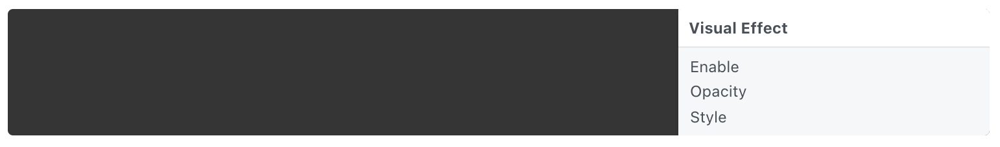

# Visual Effect 毛玻璃效果

An iOS visual effect view that blurs all the layers below it.

iOS视觉效果视图，模糊下面的所有图层。

### Enable 启用

A boolean that is true when the layer is displayed.

### Opacity 不透明度

The opacity of the layer.

### Style 样式

The style of the blur: light, very light, or dark.

模糊的样式：浅色、非常浅、深色。

------

### Related Patches 相关模块

[Classic Animation 经典动画](./../Animation/Classic%20Animation.md)

------

### Related Layers 相关图层

[Action Sheet 操作列表](./Action%20Sheet.md)

[Activity Indicator 状态指示器](./Activity%20Indicator.md)

[Alert View 警示框](./Alert%20View.md)

[Fake Keyboard 模拟键盘](./Fake%20Keyboard.md)

[Navigation Bar 导航栏](./Navigation%20Bar.md)

[Notification 通知](./Notification.md)

[Page Control 分页控制器](./Page%20Control.md)

[Screen 屏幕](./Screen.md)

[Segmented Control 分段控制器](./Segmented%20Control.md)

[Slider 滑块](./Slider.md)

[Status Bar 状态栏](./Status%20bar.md)

[Switch 开关](./Switch.md)

[Tab Bar 标签栏](./Tab%20Bar.md)

[Text Field 文本输入框](./Text%20Field.md)
