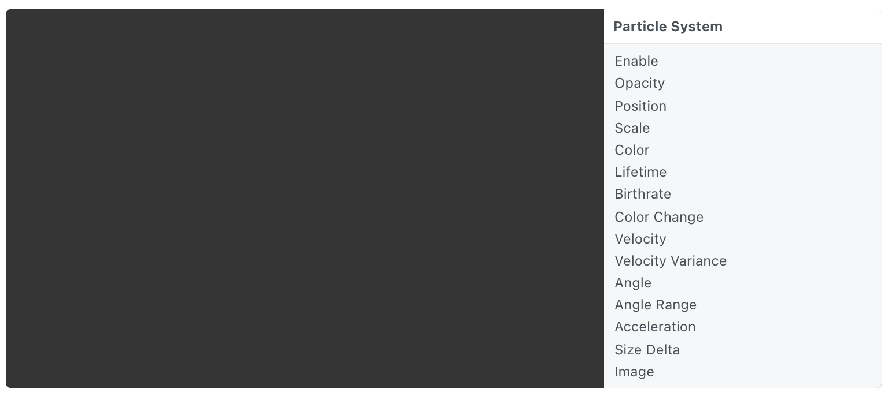
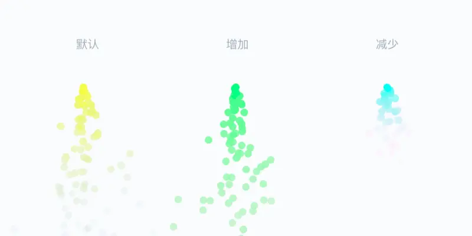
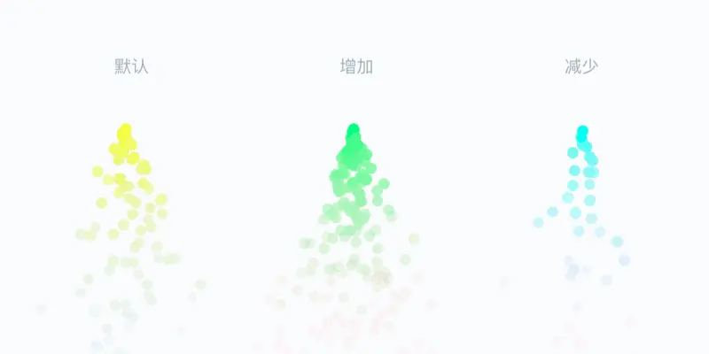
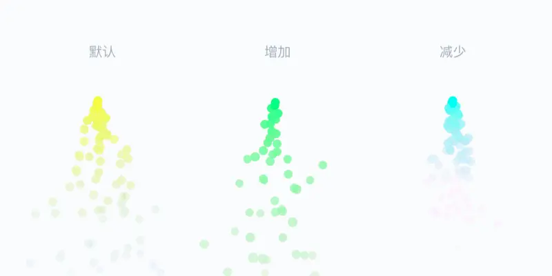
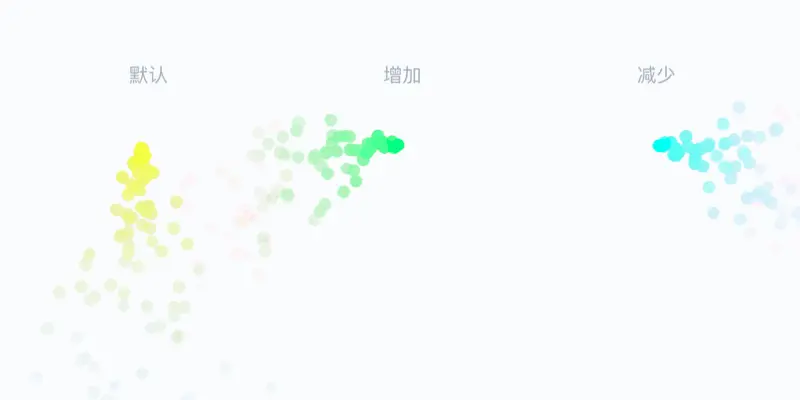
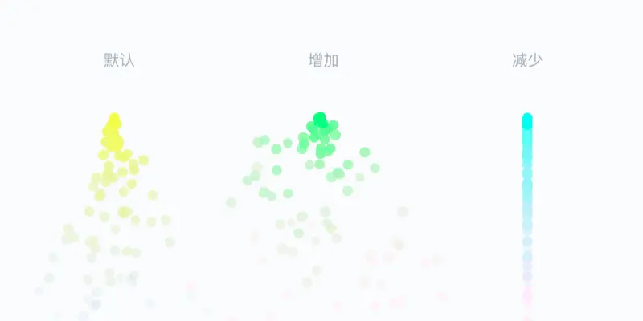
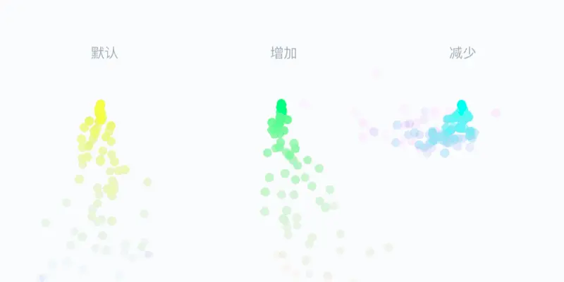
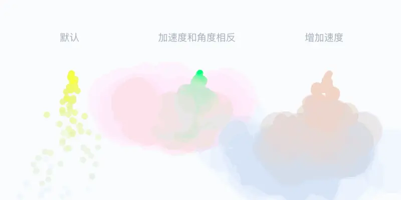
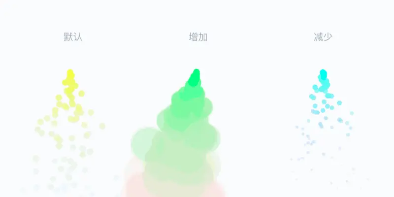
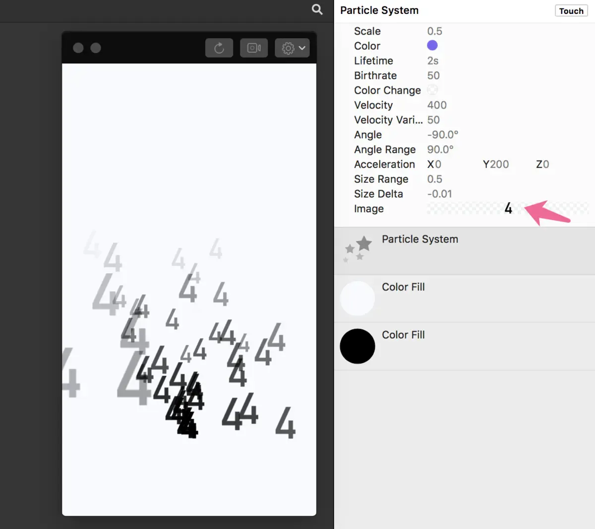

# Particle System 粒子系统

A particle emitter. Configure the specific birthrate, velocity, angle and color change over their lifetime. Add an image to replace the standard circular particle.

粒子发射器。设置其生命周期内的特定出生率、速度、角度和颜色变化。添加图像以替换默认的圆形粒子。

### Enable 启用

A boolean that is true when the layer is displayed.

勾选启用图层。

### Opacity 不透明度

The opacity of the layer.

图层的不透明度。

### Position 位置

The position to display the layer. Use [Point 3D](./../Utility/Point%203D.md) to set Z position.

显示图层的位置。使用 Point 3D 设置 Z 位置。

### Scale 比例

The scale of a particle.

粒子的比例

### Color 颜色

The color of a particle when it is generated.

粒子生成后的颜色。

### Lifetime 寿命

The duration a particle lasts, in seconds.

单个粒子生存的时间，正数，以秒为单位。

寿命：值越大生存时间越长

### Birthrate 出生率

The number of particles generated.

出生率：值越大数量越多

生成的粒子数量。

### Color Change 颜色变化

The color of a particle when it disappears.

粒子消失时的颜色。（示例图中颜色浅的那边）

### Velocity 速度

The base speed of a particle as it flies out.

粒子出生时的速度。

速度：值越大速度越快，对角度的执行越明显

### Velocity Variance 随机速度范围

A number that represents the range of randomized speeds of a particle.

表示粒子的随机速度范围的值。

### Angle 角度

The base angle of a particle as it flies out.

粒子出生时的方向。

角度：对应旋转属性的Z轴方向，0～360度为从三点钟方向开始顺时针旋转一周

### Angle Range 随机角度范围

A number that represents the range of randomized angles of a particle.

表示粒子的随机化角度范围的数字。（以角度中设置的值为中轴，左右两侧对称分布）

随机角度范围：0～360之间的数，数字控制范围，不区分正负值

### Acceleration 加速度

A vector that represents the acceleration of particles in each axis.

控制粒子消亡的角度和速度。

加速度：XYZ轴的正负值控制方向，数字的大小控制速度快慢

补充：

“速度+角度”控制出生的速度和角度，“加速度”控制消亡的速度和角度，三个属性相互影响。

### Delta 大小增量

A number that represents the range of randomized sizes of a particle.

表示粒子随机大小范围的数字。

大小增量：0为不放大不缩小，负数为缩小，正数为放大

### Image 图像

An image that replaces the default circle as the particle.

将默认圆粒子替换为图像。

图片的 Color 无法改变，Color Change 只能调整透明度；双击Image 的值添加图片；选中 Image 的值按 Del 删除图片。

------

### Related Patches 相关模块

[Image 图片](./Image%20Layer.md)
