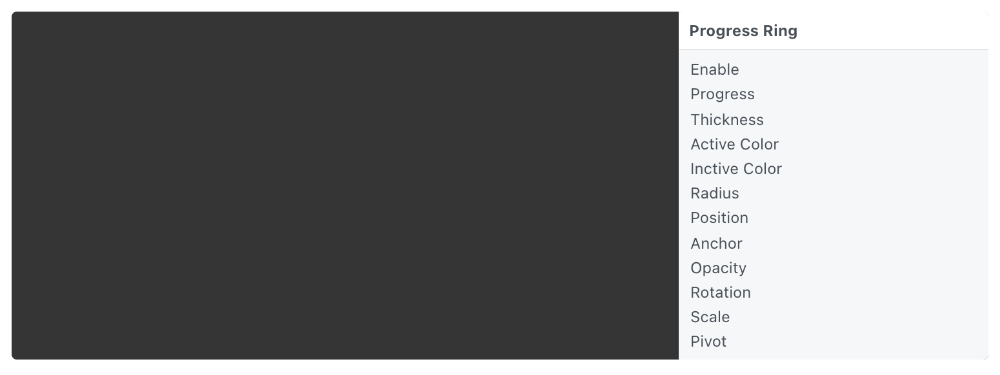

# Progress Ring 进度圈

Create a customizable circular progress layer.

创建一个可自定义的圆形进度图层。

### Enable 启用

A boolean that is true when the progress ring is displayed.

一个布尔值，表示显示进度环时为真。

### Progress 进度

A progress value from 0 to 1 that controls how much of the progress ring is filled.

一个从 0 到 1 的进度值，用于控制进度环的进度。

### Thickness 粗细

A number that represents the thickness of the progress ring, in points.

一个数字，表示进度环的粗细，以磅为单位。

### Active Color 焦点颜色

The color of the in-progress part of the ring.

圆环的进行中部分的颜色。

### Inactive Color  无效的颜色

The color of the background part of the ring.

圆环中背景部分的颜色。

### Radius 圆角

A number that represents the radius of the ring, in points.

一个代表圆环半径的数字，以磅为单位。

### Position 位置

The position of the progress ring.

进度环的位置。

### Anchor 锚点

The anchor point to position the layer relative to. See [Coordinates 坐标](./../Concepts/Coordinates.md) for more information.

相对于定位图层的锚点。有关详细信息，请参阅坐标。

### Opacity 不透明度

The opacity of the progress ring.

进度环的不透明度。

### Rotation 旋转

The rotation of the progress ring.

进度环的旋转。

### Scale 缩放

The scale of the progress ring.

进度环的缩放。

### Pivot 轴心点

The pivot to rotate and scale the layer about. See [Coordinates 坐标](./../Concepts/Coordinates.md) for more information.

旋转和缩放图层的轴心点。有关详细信息，请参阅坐标。
