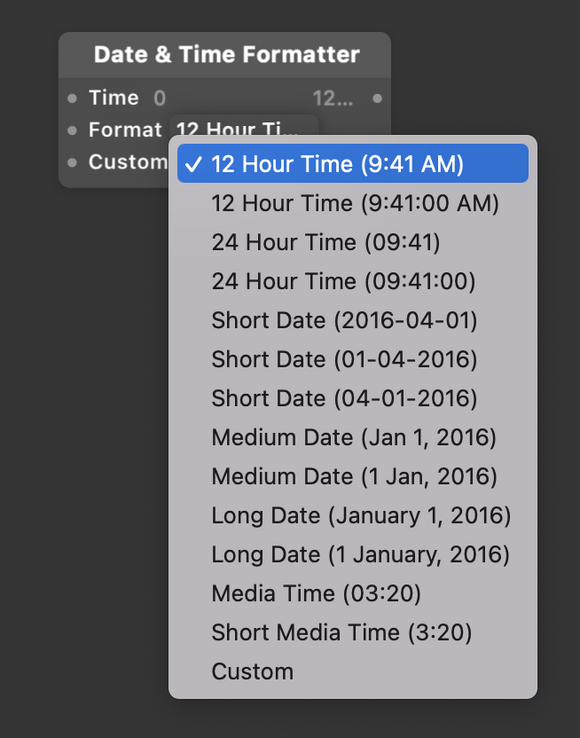

# Date & Time Formatter 日期&时间格式

Use Date & Time Formatter to make human-readable formats from time in seconds.

使用 Date & Time Formatter 模块将以秒为单位生成我们可读的时间格式。

### Time 时间

The number of seconds that represents time or date.

表示时间或日期的秒数。

### Format 格式

The time format to output (12/24 hour time, date, media time, custom)

选择输出的时间格式。（例：9:42 AM、2016-4-13、03:00）

### Custom Format 自定义格式

A text string that represents a format of time (ex: %H:%M:%S, %m/%d/%y). See the [strftime documentation](http://www.cplusplus.com/reference/ctime/strftime/).

一个字符串，表示时间格式。

### Type 类型

### Output 输出

A text string that represents the formatted time or date.

一个字符串，表示按定义的格式显示时间、日期。

------

### Related Patches 相关模块

[Time 时间](./Time.md)

[Stopwatch 秒表](./Stopwatch.md)

[Video Info 视频信息](./Video%20Info.md)

[Device Time 设备时间](./../Device/Device%20Time.md)

------

### Related Layers 相关图层

[Video File 视频文件](./../Layer/Video%20File.md)
