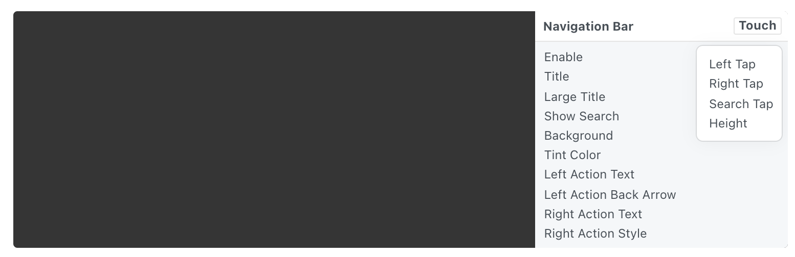

# Navigation Bar 导航栏

An iOS navigation bar with customizable left and right actions. It offers large and standard title styles. Add sub-layers to customize the contents of the search bar.

iOS导航栏可自定义左右动作按钮。提供大的和标准标题样式。添加子图层以自定义搜索栏的内容。

Use the Touch button on the component to capture taps on individual buttons in the navigation bar.

使用组件上的Touch按钮来捕获导航栏中单个按钮上的点击。

### Enable 启用

A boolean that is true when the status bar is displayed.

一个布尔值，表示显示状态栏时，布尔值为真。

### Title 标题 

A text string that represents the title of the page.

一个文本字符串，表示页面的标题。

### Large Title 大标题

A boolean that is true when the title is using a large title treatment. Turn off when scrolling past the initial state.

一个布尔值，表示当标题使用大型标题时，布尔值为真。滚动超过初始状态时关闭。

### Show Search 显示搜索

A boolean that shows a search field in the navigation bar.

一个布尔值，表示是否显示导航栏中的搜索框。

### Background 背景

The color of the navigation bar.

导航栏的背景颜色。

### Tint Color 色调颜色

The color of the left and right text buttons.

左侧和右侧文本按钮的颜色。

### Left Action Text 左侧动作文本

A text string that represents the title of the left button.

一个文本字符串，表示左按钮的标题。

### Left Action Back Arrow 左侧返回箭头

A boolean that displays a back arrow in the left.

一个布尔值，表示在左侧显示返回箭头。

### Right Action Text 右侧动作文本

A text string that represents the title of the right button.

表示右侧标题的文本字符串。

### Right Action Style 右侧动作样式

Text style for Right Text: plain (blue), done (semi-bold and blue), inactive (grey).

右侧文本的样式：普通（蓝色），完成（中粗体和蓝色），无效（灰色）。

### Left Tap 点击左侧

A pulse that represents when the left button is tapped.

一个脉冲，表示点击左侧按钮时。

### Right Tap 点击右侧

A pulse that represents when the right button is tapped.

一个脉冲，表示点击右侧按钮时。

### Search Tap 点击搜索

A pulse that represents when the search bar is tapped.

一个脉冲，表示点击搜索栏时。

### Height 高度

A number representing the height of the navigation bar, in points.

表示导航栏高度的数字，以点为单位。

------

### Related Layers 相关图层

[Action Sheet 操作列表](./Action%20Sheet.md)

[Activity Indicator 状态指示器](./Activity%20Indicator.md)

[Alert View 警示框](./Alert%20View.md)

[Fake Keyboard 模拟键盘](./Fake%20Keyboard.md)

[Notification 通知](./Notification.md)

[Page Control 分页控制器](./Page%20Control.md)

[Screen 屏幕](./Screen.md)

[Segmented Control 分段控制器](./Segmented%20Control.md)

[Slider 滑块](./Slider.md)

[Status Bar 状态栏](./Status%20bar.md)

[Switch 开关](./Switch.md)

[Tab Bar 标签栏](./Tab%20Bar.md)

[Text Field 文本输入框](./Text%20Field.md)

[Visual Effect 毛玻璃效果](./Visual%20Effect.md)
