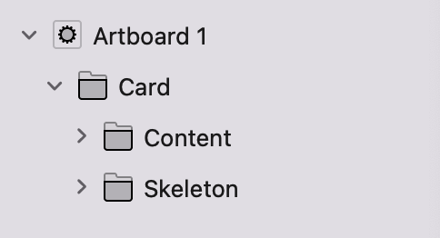

# 骨架屏加载动画

---

## 动画示例

-
Skeleton骨架屏加载动画

💡 背景：在长时间等待数据加载中，给用户提供一个更好的视觉效果和体验。

⭐️ 目标：了解Repeating Animation和HSL Color

🔎 重点：Repeating Animation的使用

⏱ 耗时：10分钟

🔧 工具：Origami Studio

🗂 文件：提供 Origami Studio、Sketch 和源文件 

## 😀 步骤 1  

明确需要实现的交互效果。

下面是交互清单：
- 占位图形随着加载在亮度上有深浅的层次变化

- 在一定延迟加载后，信息内容入场

## 😀 步骤 2 

将设计图层整理进Origami。

在Origami中大致的图层组：

图层组

Content组表示加载完后需要显示的内容，直接放一张静态图片或者分图层放入都可以。

Skeleton组表示设计的骨架屏加载动画。

## 😀 步骤 3
开始设计Skeleton加载动画。

在这一步我们需要使用的核心patch包括：

- Repeating Animation

- HSL Color

Repeating Animation可以支持我们重复某一动画

HSL Color可以支持我们改变图层的Hue、Saturation、Lightness、Alpha属性

### 将这两个patch建立好

并把 HSL Color 的属性值改为灰色

如图：

patch图

### 开始设计加载动画

在这里加载动画用的原理是让图层在两种灰色之间来回变换，所以我们需要用到 Transition patch来帮助我们实现这个效果

如图：

patch图

表示当 Transition 当接收到信号的时候，将在 0.96 和 0.92 数值之间重复变换，我们将这个输出连接到灰色的 Lightness 属性上面。

(注：连接到 Alpha 属性也能达到一样的效果)

### 完成动画

将刚刚建立好的 patch 连接好

如图：

patch图

### 预览动画

打开Viewer预览，我们将会看到如下的动画：

加载动画

## 😀 步骤 4

将做好的动画合并为组件。

到这里我们已经实现了加载动效，但是在实际项目中，我们会根据卡片中的字段，会设计对应的占位图形，所以我们现在要把刚刚做好的动画建立为组件。

(提前将shape图层的尺寸设置为100%，方便我们后面自由设置组件大小。)

同时选中Skeleton图层组和对应patch，打开右键选择 Group Into Component合并为组件。

如图：

示例图

## 😀 步骤 5

调整占位图形。

复制多个Skeleton组件并调整大小和版式

如图：

示例图

## 😀 步骤 6

最后完成动画。

明确动画规则：

当原型启动时，骨架屏加载2秒后显示内容。

在这一步我们需要使用的核心patch包括：

- When Prototype Starts

- Delay

如图：

patch图

表示当原型启动时，延迟2秒后，打开开关，Content图层组将从透明度0到1，在这里我们还加入了 Classic Animation，让透明度的变化更加的自然。

## ⌛️ 时间效率

在整个环节中，在调整占位图形的大小和版式这一并不是那么重要的环节时，花费的时间比较大，下面会在学习中研究是否有更快捷的方式。

比如根据设置的字段区域大小，自动生成占位版式。

## 🤔 总结

骨架屏加载作为一个通用的设计组件，可以整理进设计系统里，方便其他页面及以后的使用。

也可以不断的进行完善，以适应不同场景的需求，和不同阶段的设计师。比如，可以直接在Origami的属性面板，快捷调整占位图形的样式(大小，圆角等)

## 🗂 文件

如果您想使用此 Origami Studio 文件，可以复制链接进行下载使用。

链接: https://pan.baidu.com/s/1O6Tqfpx30OTZs3AtkcxBVw?pwd=j7kf 

提取码: j7kf
